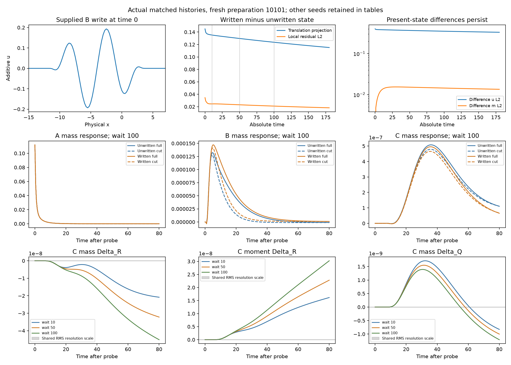

# History-conditioned transmission evidence

This package contains only the new write–wait–probe cycle. The
[living report](../../experiments/mediated_patterns/HISTORY_CONDITIONED_TRANSMISSION.md)
owns the physical question, prospective choices, findings and limits. Previous
reduction, C-probe and relay artifacts remain unchanged.

- [Frozen contract and new numerical floors](data/work/mediated_patterns/history_conditioned_transmission/frozen-01/freeze.json)
- [Fresh results, including all prediction checks](data/work/mediated_patterns/history_conditioned_transmission/analysis-01/summary.json)
- [Exact commands](data/work/mediated_patterns/history_conditioned_transmission/commands.txt)
- [Artifact sizes and SHA-256 hashes](artifacts.json)
- [Critical review](review.md)
- [Remote verification receipt](publication.json)



The pilot preserves both even and odd writes. The screen, development panel,
full-history refinements, prospective freeze, and all three fresh preparations
are retained. No fresh preparation or adverse delay is omitted. Saved data
include actual input norms/source/energy increments, fixed-frame geometry,
readouts, state checkpoints, control masks, endpoints, tangent predictions and
execution costs. NPZ files load with `allow_pickle=False`.

`history.npz` contains one exact initial state; `post_write` and each checkpoint
have history order unwritten/written (pilot: unwritten/even/odd). `absolute` is
(time, history, A/B/C, mass/moment/mean-mediator). `changes` stores full delta-u
L2, full delta-m L2, local translation projection, and its local residual L2.
These descriptors never change an actuator or evolve a registered state.

Probe files use the existing relay dimensions. `absolute` branch order is full
sham, cut sham, then full/cut for each amplitude. `full` and `cut` are differences
from that file's own history-specific sham; `qb=full-cut`. Between corresponding
written/unwritten files, Delta_R=full_written-full_unwritten and
Delta_Q=qb_written-qb_unwritten. Absolute time is saved separately from time
since the probe. Every fresh tangent-only prediction file is saved before its
nonlinear counterpart; ordered budget sections and matching initial hashes
record that ordering. The tangent's own future sham is privileged diagnostic
information, not an autonomous compact predictor.

Each protocol pins the executed Git revision and scientific source hashes.
Those revisions are ancestors of publication; `git show REV:path` retrieves the
executed code, without duplicating the entire historical source tree. The
frozen source comparison is enforced before fresh evaluation. Run receipts plus
the explicit accounting allowance cover the bounded science budget.

This uses the existing portable `data/<original-path>` convention and safe-copy
helpers. Verification/restoration reads only this new manifest and runs no
simulation or historical archival audit:

```bash
python3 -I evidence/history-conditioned-transmission-2026-09-26/restore.py --verify-only
python3 -I evidence/history-conditioned-transmission-2026-09-26/restore.py --destination /chosen/new-empty-directory
```

Restoration refuses existing files, traversal and symlinks. Git plus checksums
preserves inspectable bytes; this is not platform-enforced immutability. No
release asset or existing tag is replaced. Public scope is scientific lab data,
commands and provenance only, excluding credentials, conversation exports and
unrelated project material.
