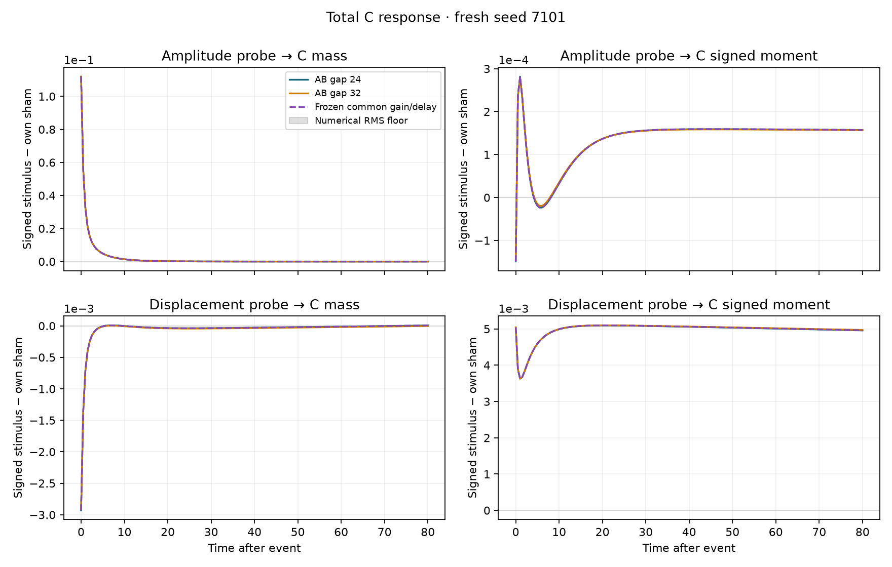
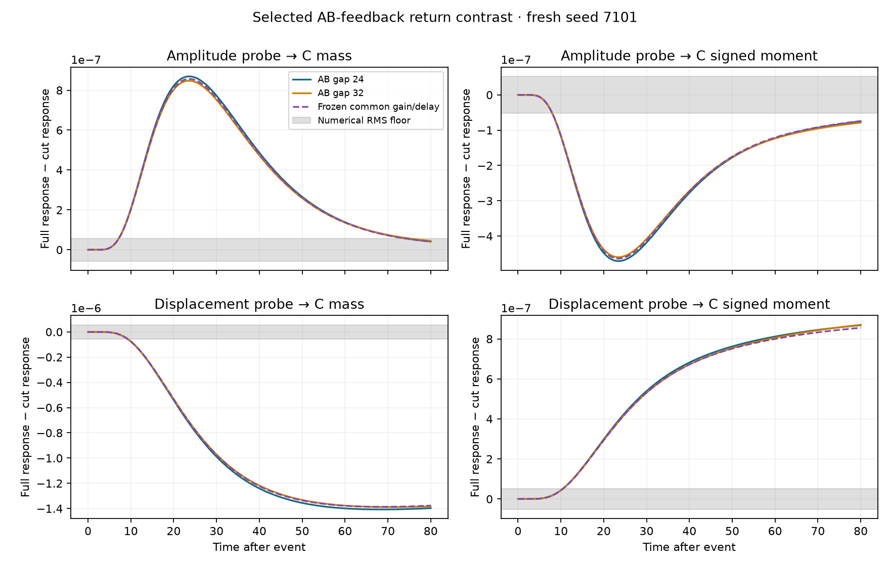
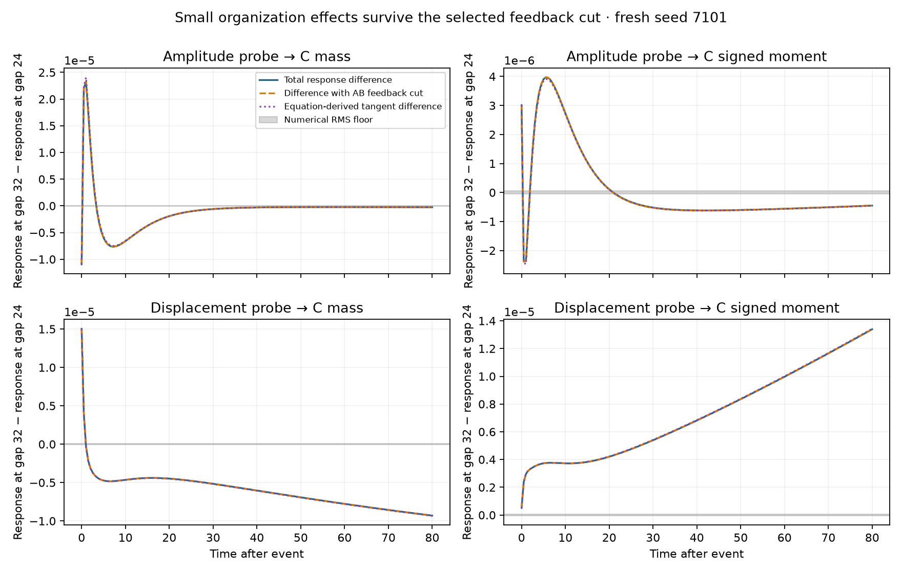

# Organization-conditioned response — incremental evidence

Exploratory research evidence, published for later review; unreviewed and
unmerged. This index preserves the completed result and introduces no new
scientific execution or interpretation. The snapshot identifier comes from the
2026-09-25 prospective contract and completed report; its original freeze SHA-256
is `8404178d212d31bcefb435152c8a4d0ef99c667e87c7581f14a59661cd79375e`.

## Result and review entry points

> No practical selectivity met the declared 5% criterion. Across three fresh
> seeds, frozen gain-fit errors were 0.084–0.107% for total response and
> 0.578–0.823% for the selected return. Small resolved shape differences remain;
> organization-dependent changes in the selected return are below the numerical
> floor. The earlier mediated-interaction and AB20/C32 results are unchanged.

These percentages are fit errors, not gain magnitudes. The conclusion is local
to the supplied organizations, probes, preparations, readouts and 80-unit horizon.
It does not assert exact equality, no organization effect, absence of the return
pathway, or a universal no-go result. The original report's pending Atlas
paragraph is unchanged; no Atlas edit or successor is selected.

- [Completed report](../../experiments/mediated_patterns/ORGANIZATION_RESPONSE.md)
- [Response runner](../../experiments/mediated_patterns/organization_response.py)
  and [ten original instrument tests](../../experiments/mediated_patterns/tests/test_organization_response.py)
- [Original prospective contract](data/work/mediated_patterns/organization_response/development-01/contract.md)
- [Frozen configuration, coefficients, floors and criteria](data/work/mediated_patterns/organization_response/frozen-01/freeze.json)
- [Fresh comparator/prediction table](data/work/mediated_patterns/organization_response/analysis-01/summary.json)
  and [descriptive saved-data details](data/work/mediated_patterns/organization_response/review-01/details.json)
- [Exact historical commands](data/work/mediated_patterns/organization_response/review-checks-01/commands.txt)
  and [analysis script originally in ignored work](data/work/mediated_patterns/organization_response/analysis-01/report_calculations.py)

The original report and records retain their execution-time paths and
local/uncommitted/no-push wording. They are frozen historical records. This living
index and [publication receipt](publication.json) supply later publication state
and portable links. Relative `work/` images in the original report become local
links after explicit restoration; the images below are directly viewable in Git.







## Scope, storage and provenance

All **163 extant new work files, 8,853,052 bytes (8.44 MiB)** are in this Git
snapshot under `data/<original-relative-path>`. [artifacts.json](artifacts.json)
records every member's original path, exact size and SHA-256. No new archive,
release asset or tag is necessary: archive count and archive bytes are zero.
The 25 MiB newly tracked generated-evidence ceiling is respected; none of the
500 MiB compressed-asset allowance is used. This is versioned, checksum-recorded
storage, not a claim of platform-enforced immutability.

The snapshot contains development, numerical qualification, freeze and fresh
records; ten prepared fields; original branch readouts and response/controlled
contrast/tangent traces; probe definitions and actual injected magnitudes/work;
source strengths and descriptors; fitted gains and floors; budget/check logs;
plots; exact commands; and all 110 stage-captured source files. Contrary cases,
the analytic mass-only observability failure, small resolved total-response
residuals and sub-floor return changes remain as originally reported. No data
were generated to fill an absent experiment, and the conditional mixture was
never executed. No extant substantive new file is left local-only.

[source-records.json](source-records.json) identifies the completed source,
tests, report and the [pre-publication handoff bytes](execution-records/lab-README-before-publication.md).
All 110 protocol source-hash references and 166 entries in the original final
review manifest matched the available bytes before the living handoff append.
Multiple executed runner versions remain intact. Execution occurred in a dirty
worktree based on `1c555d5aab826418c81e0a9005a85200e3f8fd65`; the later source
snapshot commit is **preservation identity**, not retrospective execution identity.
The source snapshot and later verification/documentation head are distinguished
in the publication receipt and draft PR body.

[provenance-gaps.json](provenance-gaps.json) records the dirty-worktree provenance,
partial historical environment inventory and unchanged execution-time wording.
The saved summary agrees with the reported fit-error ranges. This consistency
check is not scientific replication or implementation certification.

[disclosure-review.json](disclosure-review.json) records the scoped public-data
review. Only this lab's scientific artifacts and execution-source snapshots are
included; no credentials, conversation exports, unrelated workplace documents,
environments or caches were included. Original local source-path metadata is
retained and disclosed. No original was silently redacted. The
[excluded-cache list](excluded-caches.json) is empty for this new work tree.

## Inherited dependency and PR base

This branch starts at the exact recorded base above. At the publication check,
[preservation PR #1](https://github.com/gomercin/JEPA-Anything-experiments/pull/1)
was OPEN, draft and unmerged, with that head. The experiment's separate draft PR
therefore targets `codex/preserve-completed-experiments`, showing only this new
experiment. Its exact URL and publication state are in the receipt. PR #1 was
not edited, and no default-branch push, force-push or merge is part of this task.

[inherited-dependencies.json](inherited-dependencies.json) records the earlier
index, source snapshot `e17fe41d07a03d3a7fe67955054112773e8344be`, evidence tag,
archive hashes/URLs, and required inherited Git-source hashes separately. The
earlier release pointers and annotated tag target were checked remotely, but
the large historical archives were not downloaded, copied or repackaged.

**No inherited archive is required to inspect or restore this new result.**
The new runner's supporting modules and the reused restoration safety helpers
are present in the Git ancestry. A deliberately requested later reproduction
of historical AB20/C32 commands would additionally need the existing
[completed-evidence package](../completed-2026-09-25/README.md). Nothing here
downloads it or starts any reproduction automatically.

## Explicit restoration and saved-data-only inspection

Use Python 3.11+ and NumPy for saved-array inspection. Cloning this branch obtains
all new evidence through Git. From that clone, verify the indexed snapshot:

```bash
python3 -I evidence/organization-response-2026-09-25/restore.py --verify-only
python3 -I evidence/organization-response-2026-09-25/saved_data_smoke.py --root evidence/organization-response-2026-09-25/data
```

To restore original relative paths, choose an empty destination or a checkout
without an existing `work/mediated_patterns/organization_response/` tree:

```bash
python3 -I evidence/organization-response-2026-09-25/restore.py --destination /chosen/empty/evidence-root
python3 -I evidence/organization-response-2026-09-25/restore.py --destination /chosen/empty/evidence-root --verify-only
python3 -I evidence/organization-response-2026-09-25/saved_data_smoke.py --root /chosen/empty/evidence-root
```

The small [restore wrapper](restore.py) reuses the prior snapshot's unchanged
stdlib path/checksum helpers. It validates the complete scoped manifest and
source bytes before copying, rejects traversal, symlinks and duplicate members,
refuses **any existing result file**, and checks every restored hash. It neither
downloads evidence nor imports a scientific model. Never restore over the
original populated lab directory.

[saved_data_smoke.py](saved_data_smoke.py) uses stdlib/NumPy only, with
`allow_pickle=False`; it reads the configuration, gain fits, thresholds, floors,
preparation arrays, traces and recorded summary table. `python -I` prevents an
editable checkout path from supplying experiment imports; the script imports
none. This verifies persistence and serialization, not independent reproduction.
The archived original analysis script imports the lab runner and is not used
for publication checks. Historical reproduction commands remain historical;
publication does not run them.

## Checks and remote verification

The original **ten passing experiment tests** and **4.51/30 CPU-minute budget
charge** are historical execution facts, retained verbatim in their saved
records. They are distinct from publication checks in [checks.json](checks.json).
Publication runs only file/path/checksum/serialization tests, static checks,
index-link validation and saved-data inspection. No simulation, fit,
recalibration, new probe or scientific panel is run for publication.

The existing hosted workflow runs `make check`; its old oscillator quick-panel
test is explicitly excluded. The new publication tests only inspect bytes and
serialization and trigger no download. Existing fast scientific-code unit
fixtures remain software checks, not new scientific panels. Hosted CI status is
reported as actually observed, independently of verified storage.

The publication receipt records fresh HTTPS-clone verification at the source
snapshot, restore into a separate empty directory, every member hash and saved
data readability. A final documentation commit may follow; its exact pushed
head and matching PR head/base are pinned externally in the draft PR body,
avoiding a self-referential Git hash. Final remote verification is recorded there
and in the publication handoff. Stop after publication; no successor is selected.
