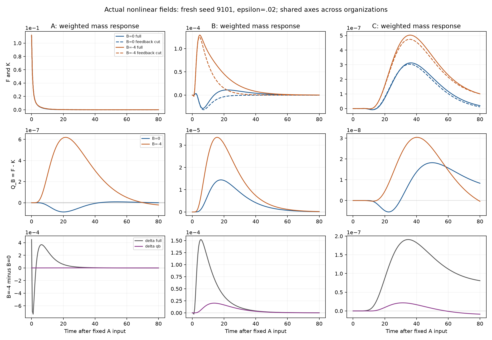

# Fixed-source relay evidence

This incremental package preserves only the new source-to-receiver experiment.
The [living report](../../experiments/mediated_patterns/SOURCE_RECEIVER_RELAY.md)
separates the scientific outcome, prediction limits and publication status.
The previous completed-reduction and C-probe packages are not republished.

- [Prospective freeze](data/work/mediated_patterns/source_receiver_relay/frozen-01/freeze.json)
- [Fresh summary](data/work/mediated_patterns/source_receiver_relay/analysis-01/summary.json)
- [All member hashes and sizes](artifacts.json)
- [Actual commands](data/work/mediated_patterns/source_receiver_relay/commands.txt)
- [Critical review](review.md)
- [Publication and remote verification receipt](publication.json)



All preparations, tangent-only predictions, full/control branch readouts,
endpoints, intervention profiles, geometry, source/work values, refinement
checks, translated-mask diagnostic, frozen fits and failures are retained.
NPZ arrays load with `allow_pickle=False`. Dimensions for `absolute` are
(time, branch, A/B/C, mass/moment/mean-mediator); branch order is full sham,
cut sham, then full/cut for each listed amplitude. `full`, `cut`, `qb` have
(time, input, A/B/C, readout). Tangents correspond to amplitude .02.

Each run protocol records its exact Git source revision and source hashes.
Those revisions are ancestors of this publication; use `git show REV:path`
to inspect the executed bytes. No later revision is assigned retrospectively.
The source snapshot is Git history rather than another copy of every old
module in every stage. Fresh predictions were persisted before each nonlinear
reference and use the full sham as privileged diagnostic information.

The artifact manifest uses the existing portable `data/<original-path>`
convention. Verification/restoration reuses the unchanged historical safe-copy
helpers, but reads only this new manifest; it never opens an old archive,
advances a field, or downloads anything.

```bash
python3 -I evidence/source-receiver-relay-2026-09-25/restore.py --verify-only
python3 -I evidence/source-receiver-relay-2026-09-25/restore.py --destination /chosen/new-empty-directory
```

Existing files, unsafe paths and symlinks are refused. This is checksum-recorded
Git storage, not platform-enforced immutability. The new package is below 25 MiB;
no release asset or existing tag is created or replaced. Scope review includes
only laboratory scientific data, commands and source provenance. No credentials,
conversation exports, unrelated project material or workplace data is included.
