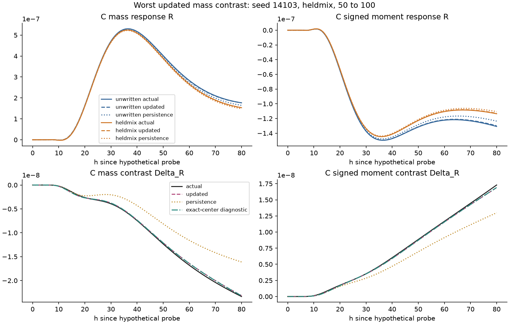
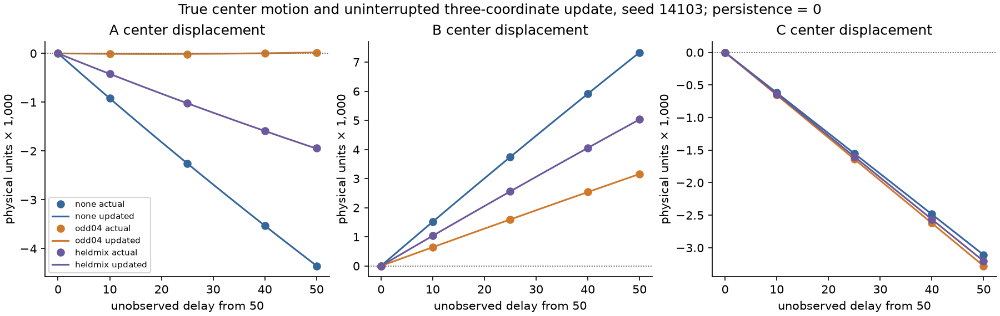
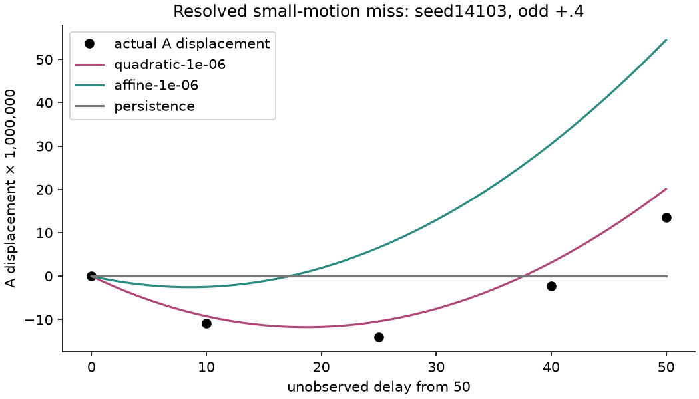

# Geometry evolution through an unobserved interval

**Result: useful delayed-response prediction, with a resolved weak-motion limit.**
A shared three-coordinate update earns a clear improvement over persistence.
On three new preparations, the selected quadratic law plus the **unchanged**
response model has worst mass/moment R errors **.342%/.421%** and history-contrast
errors **1.910%/1.613%**, passing every 2%/10% response gate. Persistence gives
3.789%/5.222% and 32.035%/23.656%. All physical coordinate-error tolerances pass,
but the strict relative-motion gate fails for the almost stationary A center in
one preparation:41.8% from 50 and 25.1% from 60. Thus the complete prospective
geometry-plus-response conjunction does **not** pass. Retain the useful readout
result and that accuracy boundary; no extra state or fresh-driven repair is added.

Living experiment record, 2026-09-26. Base is merged `e2cba645`.
Question: can three measured fixed-window A/B/C center offsets advance themselves
through an unforced interval, sufficiently for the **unchanged** snapshot-response
model to predict a later .02 fixed-A probe and its history contrast? Does updating
earn anything beyond remembering the last measurements?

## Prospective access, comparisons and resources

The original extractor, field laws, preparation recipe, physical anchors and frozen
rank-4 quadratic response model F stay unchanged. Its authoritative artifact is
`evidence/present-state-transmission-2026-09-26/data/work/mediated_patterns/present_state_transmission/frozen-01/models.json`,
key `geometry`, file SHA256 `f0bc4ced6914bc43148d615912619370465ce48332a140dd41af52b7b85bb74e`.
The primary evolving state is exactly three current offsets; no field, twin,
seed, write label, absolute age, future center or response is an inference input.
A single shared autonomous vector field is integrated with fixed-step RK4.
The integrator's elapsed step count is bookkeeping, never a vector-field input.
Each history starts independently. Possible delayed probes branch independently
from their actual unprobed reference origins; they never affect later origins.

Begin with persistence, a shared mean drift, and affine laws with ridge 1e-6 or
1e-3. Preprocessing is training-only. Select on complete-preparation held-out
**free rollouts**, retaining direct coordinate loss; do not move coordinates to
compensate F's error. Quadratic or one compact additional current measurement
requires a recorded discrepancy/justification first. No neural fit or broad sweep.

All earlier seeds, including 12101/12102/12103, are exposed development evidence.
Inspect original saved unprobed center traces first. Check the center-rate identity
using the actual unwrapped local coordinates within fixed C2 windows, uniform
periodic-grid quadrature and the implemented Fourier field derivative. A short
step is a diagnostic, not a source of inference features. Strong correlations
between geometry, shape, mediator and age do not prove global closure.

Development samples natural unforced trajectories at 5-unit intervals from 50
through 100, and actual nonlinear responses at 60 and 75, reusing saved responses
at 50/100. These are grouped descendants, not independent preparations. Start
with existing none/odd histories plus already qualified mixed/negative histories.
Use t0=50 and shifted t0=60, with delays to 75/100. Reserve new preparations
14101/14102/14103 and an unobserved target time 90 (from both initialization
boundaries) for final evaluation. No reference sample at 90 enters development
selection. Choose/freeze the final history subset on development evidence.

Keep separate C mass/moment errors over all 161 h=0..80 samples and h=40..80.
R must meet <=2% relative RMS and resolved Delta_R <=10% in both windows, for
each preparation/history. Save absolute residuals, maxima and per-case scores.
Save predictions before opening future reference data. Compare persistence,
updated F, and evaluator-only F(exact later centers). Retain signed update and
readout residuals and their mean-square cross term; RMSE terms do not add.
Set physical coordinate tolerances before fresh access from development motion,
F sensitivity and matched refinement. Sub-floor motion/contrast is unresolved.

Refine a representative development history/time and the worst relevant final
contrast, from the same prepared initial state through write/wait/probe, using
half dt and separately double N. Response floors are shared per readout/window:
max(1e-12, five times the largest sum of both history response refinement RMS
errors). Coordinate uncertainty is five times the largest absolute matched
center discrepancy, with a 1e-10 roundoff minimum. These numerical estimates
are not confidence intervals. F is never retuned, even if its envelope ends.

1800 aggregate CPU seconds for science, including failures and a 30-second
inspection/startup allowance; development cap 1200, roughly 600 reserved fresh.
Pilot section caps: 120 CPU/180 wall seconds and 1 GiB RSS, checked within loops.
Only one scientific process at a time. Output stages and files are exclusive,
with source hashes and failed receipts. Editing, fast tests and publication are
separate. No old evidence duplication or mutation. New Git evidence <=25 MiB.

Freeze G, F identity, stepping, coefficients, tolerances, split and time panel
before fresh preparation. Check solver-free checkpoint/resume and segmented
updates. A useful outcome is bounded unforced propagation for delayed readout;
it is not updating through probes, repeated-input closure, minimality, physical
storage localization or universal dynamics. Publish/review/merge this scope,
then append a small result to the two existing Atlas homes. No automatic successor.

## Pilot and development decisions

`pilot-01` (e22078f) uses the four original saved histories and costs .066 CPU
seconds. Persistence from 50 to 100 has worst R/Delta_R errors 5.386%/29.742%,
so updating could matter. Maximum physical A/B/C drift is .005452/.008444/.003294.
The chain-rule rate agrees with one reference step to about 1e-9 units/time;
the finite-step difference has the expected small integration-interval bias.

Before any update fitting: acquire development geometry at 5-unit spacing but
**exclude interior times 80/85/90/95 from fitting, scaling and rollout selection**.
Use 50/55/60/65/70/75/100 only. The final target at 90 tests interpolation inside
that gap, with new preparations; it is not a new dynamical regime. The saved
interior development samples are evaluator-only and are not consulted in model
selection. F adequacy is checked at actual 60/75 states as well as saved 50/100.

`development-01` costs 192.597 CPU seconds: 21 natural history continuations
from seven exposed complete preparations; 50-unit unforced continuations cost
about 1.24 seconds each and independent two-branch probe evaluations about 3.95.
All sampled histories/probes qualify. The 120 CPU/180 wall/1 GiB section bounds
have ample pilot margin. Saved wait-100 checkpoint agreement is checked per case.

`fit-01` selects affine ridge 1e-6 by grouped free-rollout physical-coordinate RMS.
Maximum held-out A/B/C errors are .0001070/.0001559/.00001686. The standardized
fit has condition 1.635. Worst delayed R/Delta_R errors are .5003%/1.8732%; exact
current F gives .5115%/2.0295%. Persistence gives 8.828%/33.752%, shared constant
drift 6.205%/32.963%. The alternative affine ridge .001 is nearly tied. This is
not a need for quadratic dynamics or additional fields; no state extension is
attempted. The response scores use a previously fitted F, so this development
panel is not fresh validation of F. New intermediate snapshots pass its diagnostic.

Before refinement/fresh access, choose maximum physical coordinate tolerances
[A,B,C]=[2e-4,2e-4,5e-5], plus <=10% RMS error relative to each coordinate's
resolved actual movement over each preparation/history/origin's selected delays.
The maximum development relative F sensitivities per unit are [6.020,.366,.136]
for mass and [10.381,1.041,.236] for moment. The sum of sensitivity times these
coordinate tolerances is about .128%/.230%, leaving most of the 2% R allowance
for the unchanged F. This is a local development error budget, not a global
contrast guarantee; Delta_R is scored independently. Refine seed 8101 mixed
(.28,.28) and its unwritten branch through times50/60/75 and probe at 75, then
freeze. Final histories are none, odd+.4 and already qualified heldmix(.2,-.2)
for seeds14101/14102/14103. The history family itself is exposed; time 90 inside
(75,100) is the withheld interpolation interval. No fresh-driven repair is planned.

**Development discrepancy and repair opportunity (before outcomes).** The
absolute coordinate gates are adequate for affine rollouts, but the additional
10% relative-motion gate is not: maximum A relative-motion RMS error is 46.8%
from 50 and 68.7% from 60, in an almost stationary A trajectory. B/C are below
2.1%/.61%. Keep this affine limitation. Try one modest quadratic autonomous law
with the same two ridge choices and the same grouped rollout selection. It
keeps exactly three measured/evolving coordinates; it changes the approximation
class, from 12 to 30 rate coefficients (plus 6 scaling numbers). Preserve both
baselines and affine, and retain all gates. This is a targeted curvature check,
not evidence of a missing physical variable or a reason to extend the field regime.

`fit-02` retains all four earlier candidates and adds only two quadratic fits.
Selected quadratic ridge 1e-6 reduces grouped rollout coordinate RMS from 1.690e-5
to 4.894e-6; largest A/B/C errors are 3.405e-5/2.526e-5/7.855e-6 and condition 7.913.
Its worst R/Delta_R errors are .4962%/2.1392%. The almost stationary A case improves
but retains a **13.97% relative-motion miss** from 60 (9.95% from 50); B/C remain
below .65%/.27%. Preserve that development limit and the unchanged10% gate.
Do not add state or keep searching to remove this small remaining miss. Fresh
results will distinguish adequate delayed readout and absolute geometry from
any remaining failure of strict fractional-motion accuracy.

`dev-refine-01` confirms the new mixed/time 75 response floor remains1e-12 in both
windows/readouts. Coordinate floors, independently measured rather than inherited,
are [1.137e-7,4.592e-7,1.276e-8] over 50/60/75. Movement resolution uses twice those
floors. Freeze the quadratic candidate plus persistence/drift/affine controls;
fixed RK4 step 1, no extra measurements, no response refit and no fresh-driven repair.

## Frozen fresh outcome

The freeze at source `cbabf57` precedes preparation of 14101/14102/14103. Each seed
has none, odd+.4 and mixed odd+.2/even−.2 histories. These history families are
already exposed development data for this task. Target90 was withheld from
fitting/scaling/selection inside the 75→100 interval; it tests interpolation,
not an unseen write family or a new field regime. All sampled regimes pass.

The measured state is exactly the three current weighted-center offsets. The
selected law is `dz/ds = C0 + sum(Ci qi) + sum(Cij qi qj)`, with
`q=(z-mu)/sigma`, integrated by RK4 at step 1. It has30 rate coefficients and 6
training-fitted scaling numbers. The derivative receives no clock. Instantaneous
full-field rates supervised fitting; none are acquired at deployment. The
original F, including scaling, rank-4 temporal basis and response coefficients,
is byte-identical. Every written/unwritten response is predicted independently.

All wait-50 predictions through 60/75/90/100 are saved before generating any
post-50 reference state. Independently initialized-at 60 predictions through
75/90/100 are then saved before generating post-60 states. The 50-origin rollout
is never reset from that later observation. Both sets are sealed before any
nonlinear probe outcome. There are 36 distinct nonlinear responses and 24 paired
contrasts; the two initialization boundaries produce63 response forecasts and 42
contrast forecasts, or 420 scalar readout/window gates. The effective replication
count remains **three preparations**. All420 response gates pass. Checkpoint
resume agrees exactly locally, and descriptor-only replay works with the solver
unavailable. Halving G's step changes the weak-motion fresh case by 2.03e-16.

| Predictor | Worst R mass | Worst R moment | Worst Delta_R mass | Worst Delta_R moment |
|---|---:|---:|---:|---:|
| Hold centers constant | 3.789% | 5.222% | 32.035% | 23.656% |
| Shared constant drift | 2.155% | 3.061% | 31.338% | 22.492% |
| Affine, retained control | .328% | .401% | 1.679% | 1.453% |
| Selected quadratic | .342% | .421% | 1.910% | 1.613% |
| F(exact later centers), evaluator only | .339% | .417% | 1.770% | 1.512% |

Affine already suffices for the delayed-response task and uses 18 learned updater
scalars. Quadratic was selected for better **physical coordinates**, before fresh
access, not to cancel F's error. Affine's slightly better fresh response scores
do not make its coordinates more accurate. Neither is upgraded to globally
closed geometry dynamics. No source/shape/mediator or initial-rate state was added.

| Selected quadratic panel | R mass | R moment | Delta_R mass | Delta_R moment |
|---|---:|---:|---:|---:|
| Whole h=0..80 | .279% | .350% | 1.910% | 1.613% |
| Late h=40..80 | .342% | .421% | 1.841% | 1.572% |
| Withheld target 90, both windows/origins | .320% | .394% | 1.741% | 1.524% |
| Separately initialized at 60 | .341% | .420% | 1.856% | 1.575% |

| Preparation | Worst R mass | Worst R moment | Worst Delta_R mass | Worst Delta_R moment |
|---|---:|---:|---:|---:|
| 14101 | .0857% | .1997% | 1.1093% | .8877% |
| 14102 | .0769% | .1534% | 1.1765% | 1.0723% |
| 14103 | .3420% | .4206% | 1.9105% | 1.6125% |

The worst R is unwritten 14103,50→100,late: mass/moment residual RMS
1.1227e-9/5.4221e-10 against response RMS 3.2832e-7/1.2892e-7; maximum absolute
residuals1.6739e-9/9.1496e-10. Worst Delta_R is that seed's mixed history,
50→100,whole: residual RMS 2.3359e-10/1.4197e-10 against contrast RMS
1.2227e-8/8.8045e-9; maxima4.1080e-10/4.0790e-10. These denominators are response
and contrast RMS, never stationary background or write-only offsets.



## Physical geometry and the remaining failure

| Quantity over fresh forecasts | A | B | C |
|---|---:|---:|---:|
| Largest true displacement from initialization | .005349 | .008324 | .003302 |
| Persistence largest coordinate error | .005349 | .008324 | .003302 |
| Affine largest coordinate error | 4.091e-5 | 4.705e-5 | 6.060e-6 |
| Quadratic largest coordinate error | 1.039e-5 | 5.473e-6 | 2.117e-6 |
| Frozen absolute error tolerance | 2e-4 | 2e-4 | 5e-5 |
| Quadratic worst error / RMS actual movement | 41.834% | .1356% | .0785% |
| Shared coordinate refinement estimate | 2.026e-7 | 6.073e-7 | 6.697e-8 |

The selected model passes all 54 coordinate absolute gates but only 52/54 combined
absolute-plus-relative gates. Both misses are A in 14103's odd+.4 history, at the
two initialization boundaries. From50, A's actual displacements at 60/75/90/100
are `[-1.09268e-5,-1.40194e-5,-2.25217e-6,+1.35524e-5]`; predicted values are
`[-9.22318e-6,-1.04104e-5,+3.14293e-6,+2.01316e-5]`. Its motion RMS 1.12325e-5
is resolved above the twice-coordinate-floor rule, and error RMS 4.69896e-6 is
41.83% of that motion. From60 the corresponding error is 25.10%. The shift to a
new initialization does not remove the limitation. Affine gives 253.4% in the
worst fractional-motion comparison. Neither failed percentage is hidden by the
much larger fixed anchor or by accurate B/C motion.





The cheapest post-freeze discriminator checks numerical refinement, integration
step size and the learned velocity at the true current centers, without refitting.
Full-history half-dt/double-N checks include this odd history as well as the worst
mixed contrast. Numerical uncertainty and G's step error are much smaller than
the remaining miss. A's instantaneous rate runs from−1.484e-6 at 50 to+1.893e-6
at 100; the quadratic rate law at those exact centers has a positive residual
about 1.3–2.2e-7. This supports a small systematic approximation error around a
turning point. It does **not** establish that geometry lacks information; we
have not exhausted ordinary fitting classes or found a descriptor collision.
No fresh panel is consumed for another repair. This is the declared stopping limit.

## Update error versus frozen readout error

All signed traces retain `total = update + readout`, where update is
`F(z_hat)-F(z_true)` and readout is `F(z_true)-R_true`. Paired contrasts apply
the same identity after independently subtracting histories. The maximum saved
identity discrepancy is zero. At the worst mixed contrast, whole-window values
are:

| Output | Update RMS | Exact-center readout RMS | Total RMS | 2 mean(update × readout) |
|---|---:|---:|---:|---:|
| mass | 1.853e-11 | 2.164e-10 | 2.336e-10 | +7.410e-21 |
| moment | 9.461e-12 | 1.331e-10 | 1.420e-10 | +2.344e-21 |

The mean update/readout residuals share sign in these cases: positive for mass,
negative for moment. Their RMS values do not add; the cross term is explicit.
F with exact later centers passes every tested response gate, including new60/75/90
states. No frozen-readout envelope failure was observed here. No causal percentage,
Delta_Q pathway fidelity or storage attribution is inferred from this decomposition.

The varied development states remain correlated: B offset correlates .99993
with B mediator moment and .99797 with C weighted mass. Pooled geometry/age
correlations are weaker, but smooth within-history relaxation still limits what
this panel identifies. No matched-feature collision or minimality theorem is
claimed. This is a useful ordinary task-relative update in an engineered late
unforced envelope. It removes later field queries/true centers/future shams from
prediction and demonstrates value beyond persistence; it does not prove universal
Markov closure, unique physical storage, independent participant reductions,
updating through writes/probes or sequential intervention capability.

## Numerical qualification, cost and reproduction

Three matched checks cover development mixed seed 8101 at 75; fresh seed 14103's
worst mixed contrast at 100; and its odd weak-motion case at 100. Each starts from
the same prepared initial array, applies the declared write, and repeats the
history/probe with half dt and separately twice N. Coordinate comparisons include
initial50, shifted60 and the final boundary. Shared response floors remain1e-12
under the predeclared five-times-summed-branch-error rule. Coordinate floors are
reported above; these are numerical estimates, not confidence intervals or
rigorous uniform bounds. All fresh motion RMS values remain resolved.

Charged science is **567.012545 CPU seconds (9.45 minutes)**:536.012545 measured,
a conservative1-second failed diagnostic import, and 30 seconds for startup and
small inspections, under1800. Development through freeze used 266.296316 including
the allowance; fresh preparation/assay used 204.263224. The two additional fresh
refinements, scoring and diagnostics remain within the roughly600-second fresh
reserve. All finite per-section120 CPU/180 wall/1 GiB checks passed. Ordinary
editing, smoke tests and publication are outside this science ledger.

Initial acquisition is one(2,768) field:1536 float64 values/12,288 bytes. E performs
a finite check over both arrays and three weighted u-squared reductions; it is
not a local observer. Only three float64 offsets(24 bytes) plus a step counter
remain dynamic. Quadratic G stores36 learned scalars; F still stores732. There
are no retained training examples or spatial templates. The published model
files include controls/metadata:3,243 bytes for G's four-model file and 69,568 for
the inherited three-response-model file; these are not three-number total storage.

Training acquired231 instantaneous rate vectors, of which147 selected-time rows
entered each full fit, across21 history trajectories and seven preparation groups.
The 8 pilot rates and 5 post-freeze diagnostic rates are also charged. Each rate
uses a full current u/m spectral PDE RHS and fixed-window reductions; those
costs are in the acquisition/pilot receipts, not hidden in G. The 5 diagnostic
rate evaluations cost .009784 CPU seconds. A single measured inference workload
cost .000193 seconds for extraction, .002480 for 50 RK4 steps(200 small polynomial
RHS calls), and .000810 for four F forecasts including static model loading.
These are workload timings, not a universal or whole-system speed advantage.

The evidence retains both fitting rounds, all baseline/affine/quadratic outcomes,
source revisions, frozen coefficients, prediction seals, reference branches,
refinements, signed residuals, failures and exposure history. One optional diagnostic
failed before execution because `inspect.py` shadowed Python's standard module;
it was retained and rerun as `diagnose.py` in a new directory. No scientific repair
followed fresh access. The old archives and scientific reports remain unchanged.

Commands are recorded exactly in the [portable index](../../evidence/geometry-evolution-2026-09-26/README.md)
and its `commands.txt`. Core invocation is:

```bash
OPENBLAS_NUM_THREADS=1 OMP_NUM_THREADS=1 python -m experiments.mediated_patterns.geometry_evolution \
  --stage fresh --freeze work/mediated_patterns/geometry_evolution/frozen-01 \
  --output work/mediated_patterns/geometry_evolution/a-new-empty-stage
python -I evidence/geometry-evolution-2026-09-26/restore.py --verify-only
make check
```

The published scientific panel is frozen evidence; do not rerun it in CI. Tests
cover the fixed-window rate identity, shared autonomous composition, train-only
scaling and complete-preparation folds, absence of metadata/clock inputs,
independent histories, prediction-before-truth order, solver-free serialized
continuation/readout, deterministic checkpoint/resume, exclusive/symlink-safe
outputs and saved subtraction/floor/error arithmetic. Publication review and
remote retrieval receipts are kept with the package. Final merge confirmations
belong in PR comments. No successor is selected by this result.
