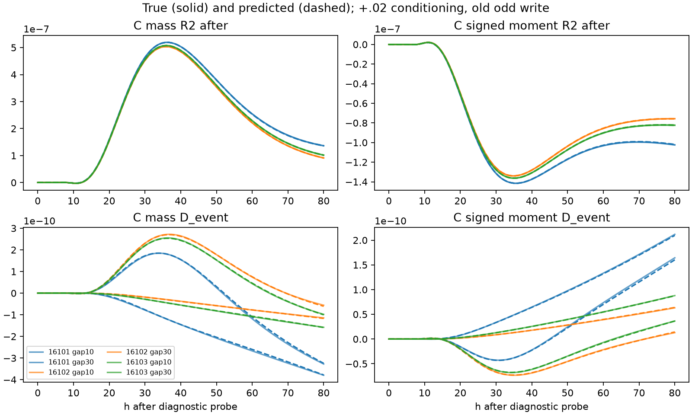
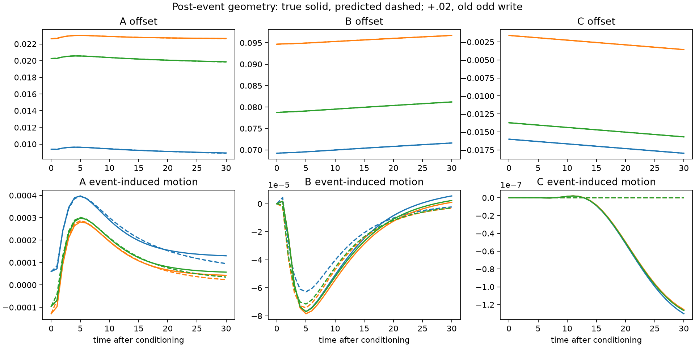

# Intervention-aware retained state

**Result: the enlarged nine-scalar state predicts the next conditional response
without returning to the fields. The original three-center G+J+F does not meet
the event-contrast target.** On three untouched preparations, all336 distinct
scalar response/contrast gates pass (432 saved entries include repeated shams):
worst R mass/moment .322%/.404%, worst D4.314%/3.544%. The event itself changes
R by only .010–.080% mass and .017–.122% moment, but this resolves numerically.
Ignoring it passes the large-R task and misses D by100%. Physical absolute
center tolerances pass fresh, while event-induced B/C motion remains limited.

Living record, 2026-09-26; base 36c25209d8d64bcdb9a10b7bc89cc2a8c387a13b.
Question: can a once-measured compact description take an actual additive A event,
retain its consequences and predict the conditional response of a later +.02 A
probe at C without any field access after initialization?

## Prospective contract

Preserve original E (`present_state_model.extract`, geometry), G (geometry frozen
quadratic-1e-06, affine control), and F (present-state frozen geometry model).
No old source or evidence changes. The earlier response pass and geometry
conjunction failure (A fractional-motion misses 41.8%/25.1%) remain unchanged.
No old pulse-response or spatial-hybrid substitute.

Same SH35/mediator laws, N=768, dt=.00625, length192, anchors[-28,-4,28].
Initialize at write-history t0=50. Pilot conditioning t1=60, a=+.02 and -.02;
alternative final +.02 probes at t2=70/90, h=0:.5:80. q is the original compact
laboratory-fixed unit-L2 source. No recentering, normalization or multiplicative
pulse. At t1 u+=a*q, m unchanged. E uses ell=x-anchor on windows not crossing
the periodic seam and uniform dx. For each window expand (u+a*q)^2 to test
z+=(M*z+2*a*I1+a²*Q1)/(M+2*a*I0+a²*Q0). All moments at t1 are evaluator-only.

Record true jumps, norm, energy/source increments, sampled regime, geometry and
conditional C mass/signed-moment responses. Y00/Y10/Y01/Y11 use identical time
steps/event boundaries. R_after=Y11-Y10, R_without=Y01-Y00, D=R_after-R_without.
Each reduced history initializes independently from its own z0. Ignore-event,
state-independent amplitude-polynomial kick, state-dependent local kick, and
F(exact current centers) are retained. Fit kicks to actual physical jumps only.
Zero amplitude is identity; immediate B/C kick is identically zero.

Primary targets: <=2% relative RMS of each R and <=10% of resolved D, separately
mass/moment, whole0:80 and late40:80. Keep absolute/max errors, signs/peak timing
and unresolved labels. Estimate numerical floors from new full four-branch
half-dt and double-N histories from the same prepared initial field: five times
the summed separate R refinement RMS per readout/window (no inherited 1e-12).
Minimum floor only float64 subtraction roundoff at measured absolute magnitude.
Physical coordinate tolerances to freeze after development resolution/sensitivity.
Keep old geometry scores as immutable prior results.

Development: exposed seeds8101,10101,10102,10103, initially none/odd04 histories;
all descendants group by initial preparation. Pilot8101 odd04. Saved old t50
states are read-only. No old seed is fresh. Small ordinary jump fits first;
at most two diagnosis-driven repair families, recorded before running them.
At least three fresh seeds16101/16102/16103, with one withheld intermediate
conditioning amplitude +.01 (same times/gaps), after model/schedule/metric freeze.
No fresh outcomes enter fitting or scaling. Predictions and retained geometry
must be written before post-t0 reference fields are generated. No true jump
reset, future response, sham, age, seed, write label or field solve in inference.
Checkpoint after the event, fresh-process solver/file-denied resume; segmented
advance and zero-event equivalence are independent of scientific accuracy.

1800 aggregate CPU seconds for scientific preparation/simulation/fitting/analysis,
including failures and 30 seconds startup/inspection allowance; development cap
1200, reserve600 fresh. One scientific process; pilot provisional per-section
120 CPU/180 wall seconds, 1GiB RSS; tighten/confirm from measured pilot. Exclusive
stage directories/outputs and source hashes, no overwrite/symlink following.
Publish substantive failures and evidence within25MiB Git (larger unique archive
only if needed), verify remote retrieval, critical review/fix, guarded merge.
Update only existing Atlas Effective Motif Dynamics and persistence homes.
No arbitrary-stream, absolute two-pulse trace, practical switch, minimality or
unique-storage claim; stop after this bounded task, without an automatic successor.

## Pilot and next discriminator

`pilot-01` costs26.347483 CPU seconds. Exact center jump identity agrees within
5.3e-17; B/C direct jumps are zero. +.02 shifts A by−1.24292e-4 but at gap10
its induced shift is+1.94780e-4; true-post-jump G still errs by−3.18022e-4.
The event excites a transient rather than merely setting a new unforced center.
Input norm .02 has source increments +.113485/−.112685 and energy increments
.000340383/.000323757, so opposite/equal-norm events do not mean equal work.
D/R is .021–.049% mass and .035–.044% moment. F at exact post-event centers has
D errors21.7%/17.6% at gap30 and281.5%/456.8% at gap10, even though R errors
are below .24%. This is a frozen-readout limitation, not a proof of missing
geometry information. Refinement must establish whether this small D resolves.

Keep the schedule/amplitudes unchanged. Complete four-preparation development,
fit the two specified J controls under unchanged G/F, and refine the entire
four-branch history at half dt/double N. Confirm pilot per-section limits120 CPU/
180 wall seconds/1GiB; measured single probes cost3.97 seconds and continuations
.75. Expected development plus numerical costs<350 CPU seconds. Before fresh,
allow two compact repair families only: (1) ordinary low-order linear transient
realization of event-induced physical center motion, with zero initialized
*incremental event state*, not assumed equilibrium; (2) low-rank response
correction driven by that evolving transient, identically zero before events.
Choose small orders by whole-preparation held-out free rollouts, preserve all
candidates, and charge every retained mode/coefficient. No absolute age input.

`development-01` failed during import before reference work (unmatched parenthesis);
its receipt is retained. Corrected before rerun in a new exclusive directory.
Transient family specification: discrete unit-time ERA orders4/6 fitted to all
0..30 event-induced center curves, train-only standardized [a,a*z,a²,a²*z]
excitation. Enforce the initial output as the fitted A-only jump, B/C exactly0.
The center law is now separately named/extended: advance G on z-Cr, r+=Ar,
then restore Cr to the physical centers. This has3+order evolving scientific
scalars plus the step counter, not three dimensions. No reference trajectory is
retained. Zero r means no *new conditioning event*, not an equilibrated old write.
Readout family: four-mode SVD correction, linear in retained transient, fitted
to development D minus the independently predicted F contrast. It is identically
zero when r=0 and keeps all original no-event predictions byte-equivalent.

`plain-fit-01`: all grouped R gates pass (worst .418%) but local kick+G/F fails
D badly; ignore predicts exactly zero D (100% relative when resolved).
`repair-fit-01`: order6 reduces worst physical A/B/C errors over0..30 to
[3.331e-5,1.398e-5,8.102e-7], versus order4[1.116e-4,3.584e-5,8.103e-7].
Its linear readout correction has worst D error161.5%, at a small2.34e-12
moment contrast. Retain it. Within the same second repair family, test one
state-dependent readout: transient coordinates times[1, standardized current
centers], with fixed ridge1e-4 and training-only scales. This tests ordinary
readout curvature/interactions rather than changing physical coordinates or
adding extraction. No new repair family, amplitude, timing or sensor search.

`refine-01` costs67.931 CPU seconds. New response floors whole/late mass are
2.339e-13/1.850e-13 and moment3.402e-13/4.525e-13. The poor small-contrast fits
remain resolved. `repair-fit-02` interaction readout worsens worst D to430.3%;
retain that failure. Last approximation within the readout family: drive a
separate two-scalar response memory directly with known event strength, rather
than asking the six geometry-optimized latent modes to encode it accurately.
The two variables are p+=a/.02 and d+=a/.02, then p'=p and d'=exp(-1/20)*d
per unit step. Correction features[p,d,p²,p*d] times[1,current standardized z],
four SVD response modes, ridge1e-4. All coefficients and scales train by grouped
preparation. The fixed20 timescale is a basis choice, not identified physical
storage. No-event initialization p=d=0 has the same incremental meaning as r.
Total candidate dimension is now11 scientific scalars plus the step counter.
This is the last readout form; freeze the best grouped candidate or retain the
restricted failure. No further architecture or data expansion is planned.

## Final development selection and freeze

`repair-fit-03` directly driven response memory is much better: order4+readout
worst grouped D14.123%, R.10643%; order6+readout D29.713%, R.10804%.
Select **order4+two response variables**, nine evolving scientific scalars plus
one integer step counter, for the primary response objective. Keep order6 as the
more accurate physical-geometry control. This retains a development response
miss, not a declaration that every development gate passed. Stop fitting here.
Physical tolerances freeze at[A,B,C]=[5e-5,2e-5,2e-6]; they exceed development
resolution by factors639/33/228 and spend roughly .031%/.057% of R in the prior
local F-sensitivity estimate. Order4 already has some trajectory errors above
these limits; keep those physical limitations rather than changing coordinates
or gates to favor its readout. Original fractional-motion failures remain intact.

Freeze seeds16101/16102/16103; none/odd04 preparation histories; conditioning
+.02/−.02 and withheld intermediate+.01; unchanged delay10 and gaps10/30.
Both signs describe conditioning only; final diagnostic probe always+.02.
No fresh-driven repair. Development response floors freeze as above; any later
worst-case numerical checks report supplemental uncertainty without converting
failed accuracy gates to passes. All primary forecasts and post-event retained
states are sealed before generating future fields. The original G/F remain
byte-identical within controls; the selected construction changes both evolution
and readout through explicit retained variables. No new initial field features.

The order6 physical realization has spectral radius1.00817 per unit step; it is
a finite0..30 approximation, not a globally stable relaxation law. Order4 has
radius.97249. Neither fitted mode decomposition uniquely identifies physical
storage or certifies arbitrary event streams.

## Frozen fresh outcome and limits

The freeze at94c0f94 precedes preparations16101/16102/16103. Each has none and
odd+.4 old-write histories. Conditioning at60 is+.02/−.02 or withheld+.01;
alternative final+.02 probes at70/90 are observed overh0..80. These are36
matched event contrasts and48 distinct R traces from three independent initial
preparations. The432 saved scalar gates contain repeated R_without entries;
there are336 distinct gates. Every one passes without fresh-driven fitting.

| Candidate | Worst R_after mass | Moment | Worst D mass | Moment |
|---|---:|---:|---:|---:|
| Ignore event, original quadratic G/F | .418% | .548% | 100% | 100% |
| Affine ignore control | .405% | .530% | 100% | 100% |
| State-independent local kick + original G/F | .519% | .692% | 564.5% | 642.9% |
| State-dependent local kick + original G/F | .328% | .413% | 452.0% | 442.9% |
| Evaluator-only F(exact later centers) | .396% | .518% | 431.3% | 758.7% |
| Four-mode geometry repair + original F | .408% | .537% | 440.6% | 769.4% |
| **Selected four-mode geometry + two-scalar response memory** | **.322%** | **.404%** | **4.314%** | **3.544%** |
| Six-mode geometry + same readout family, retained control | .324% | .405% | 3.476% | 2.717% |

The selected model remains selected even though the larger control is slightly
better fresh. Original F on exact centers is adequate for the large R but
inadequate for its much smaller event-induced change. That is a limit of this
frozen readout, not a global insufficiency theorem for centers. J predicts an
immediate physical jump; it does not absorb the ensuing deformation into the
old unforced dynamics. Both an evolution extension and a readout extension were
needed among these candidates. Neither necessity nor minimality is established.

| Selected panel | R mass | R moment | D mass | D moment |
|---|---:|---:|---:|---:|
| Whole h0..80 | .262% | .339% | 4.238% | 3.448% |
| Late h40..80 | .322% | .404% | 4.314% | 3.544% |

The withheld+.01 panel's worst D error is4.309%. This is preparation and
intermediate-amplitude transfer at fixed timing, **not** fresh timing transfer.
D RMS ranges1.507e-11 to3.491e-10 across readouts/windows. All D peak signs agree;
maximum peak-time discrepancy is one .5-unit sample. Sign changes within the
trace remain visible in the saved curves. Sub-floor early samples do not earn
pointwise accuracy claims. No absolute Y11 trace is predicted.

Worst mass D: seed16101/none/−.02/gap10/late, RMS2.37346e-10, residual RMS
1.02385e-11, max1.22189e-11. Its late peak is positive at h80, true4.22810e-10
versus predicted4.10591e-10. Worst moment D:16101/odd04/+.01/gap10/late,
RMS4.56647e-11, residual1.61853e-12, max2.11261e-12; true/predicted h80 peak
8.26124e-11/8.05434e-11. Worst R residual RMS is1.05970e-9 mass/5.27223e-10
moment, with maxima1.57048e-9/9.44383e-10. Each denominator is its own R or D,
never a stationary field magnitude or the first event's lingering output.

## Physical geometry is a separate result

Across all18 fresh conditioning trajectories and31 sampled post-event times,
maximum A/B/C errors are[4.721e-5,1.918e-5,1.202e-6], within the frozen
[5e-5,2e-5,2e-6] physical tolerances. Thus all54 fresh absolute trajectory gates
pass. Development order4 errors and its14.123% D miss remain retained failures.

The smaller **event-induced motion** is less accurate: worst relative RMS
errors A/B/C are9.70%/31.20%/100.003%. C's true induced motion RMS is at least
2.919e-8 in the fresh panel, while the selected geometry essentially predicts
zero C effect. Matched refinement of event-induced geometry has conservative
five-times-max discrepancy[A,B,C]=[5.475e-9,2.031e-10,7.910e-14] in the checked
histories. This is a resolved physical limitation, not something hidden by the
large common C trajectory. The separate response memory can still predict the
later response. Its coefficients are not mislabelled physical centers.

The original unforced study remains unchanged: selected G+F passed delayed
responses, but its joint geometry/readout criterion failed on nearly stationary
A with41.8%/25.1% fractional-motion error. Its absolute max errors
[1.039e-5,5.473e-6,2.117e-6] and fractional errors are historical, not re-scored or
relaxed here. Prior snapshot, retention, relay/selectivity and hybrid evidence
are different contracts and are not evidence of this intervention capability.

## Access, retained state and cost

E still extracts just the three centers from one current(2,768) snapshot at50.
No extra initial feature is measured. Immediately after the conditioning input,
the state contains three physical centers, four geometry-deformation coordinates,
and two directly driven response-memory scalars: **nine float64 scalars**, plus
one integer integration counter. The latter controls fixed steps and is never
an input to G. Future schedule data do not affect the state before their event.
Each predicted conditioning/no-conditioning path initializes independently.

The geometry update is z_next=G_step(z-Cr)+CAr and r_next=Ar. The A-only J and
excitation Br use the known amplitude and predicted current centers. Response
memory p,d is excited by a/.02, then p is constant and d decays by exp(−1/20)
per step. F reads the predicted physical centers; its added rank4 correction is
linear in[p,d,p²,p*d]×[1,standardized current centers]. No true twin or no-event
response enters this calculation. No microscopic reconstruction exists.

Active coefficient/basis/scaling storage is1636 scalars, including the duplicated
14-scalar J excitation descriptor: G36, J14, transient matrices60, duplicate
J14, original F732, readout extension780. The original temporal basis is644
numbers and the added one also644; both forecast161 time samples. The serialized
selected model contains1918 numeric scalars including fixed metadata and fit
diagnostics, and is40,465 compact JSON bytes. Fixed anchors3, response times161,
decay time20, unit step and amplitude scale.02 are explicit. The driver has the
declared delay and two gaps; event input buffer1, forecast output buffer322.
No prior response trace or training example is a runtime input.

Each unit step uses four10×3 quadratic G evaluations, two3×4 C products, one4×4
A product, and a scalar exponential decay. An event uses two8-term feature maps,
one8-term jump, one4×8 excitation and two scalar updates. A readout uses10×8
and16×8 coefficient products and two rank4 reconstructions per output. These are
small ordinary operations; no hidden PDE solve is included in inference.

All24 selected checkpoints at time62 resume exactly through70/90 in fresh
processes with scientific solvers and all field-array reads unavailable. Static
coefficients and serialized retained state suffice. Segmented advance and
zero-event equivalence pass. Zero auxiliary state reproduces original no-event
G/F exactly, preserving the prior saved no-event capability by construction.
Numerical/serialization closure is separate from reference accuracy.

## Numerics, resources and evidence

All sampled branches remain separated under the existing mass/width/gap/outside
bounds. The direct event identity has fresh max error1.492e-16. Actual input
norms are .01/.02; source increments span−.112687 to+.113487 and energy increments
8.400e-5 to3.404e-4. The fields are never renormalized after the event.

The full prepared-write/wait/conditioning/probe half-dt and double-N checks give
frozen whole/late response floors mass[2.339e-13,1.850e-13], moment
[3.402e-13,4.525e-13]. A supplemental fresh worst-mass-D check, including+.01,
gives up to5.907e-13. All fresh contrasts remain resolved against that larger
estimate too; no frozen failure was converted to a pass. Direct D differences
in this check are at most1.878e-14 mass/6.055e-15 moment RMS. These estimates are
numerical diagnostics, not statistical confidence intervals or uniform bounds.

Charged science plus solver-free audit is526.34 CPU seconds (8.77 minutes),
including30 seconds for startup/small inspections and the failed import.
Fresh evaluation cost175.37 seconds; supplemental fresh refinement73.75 seconds.
Per-section limits remained120 CPU/180 wall seconds/1GiB, aggregate1800, with
1200 development ceiling. No paid compute or new dependencies. Stop here;
the optional extra two-conditioning-event prefix was not attempted.

The [portable package](../../evidence/intervention-aware-state-2026-09-26/README.md)
contains all substantive stages, including import failure, failed candidates,
refinements, frozen models, pre-reference prediction seals, exact four-branch
readouts, per-case gates, geometry, source identities, commands and runtime
audit. [Critical review](../../evidence/intervention-aware-state-2026-09-26/review.md)
keeps the response success, physical limits and publication checks separate.
This supports a bounded useful augmented response state after one real hit;
it does not establish full absolute-trace prediction, arbitrary event streams,
a practical switch, unique storage, minimal state or recursive composability.
