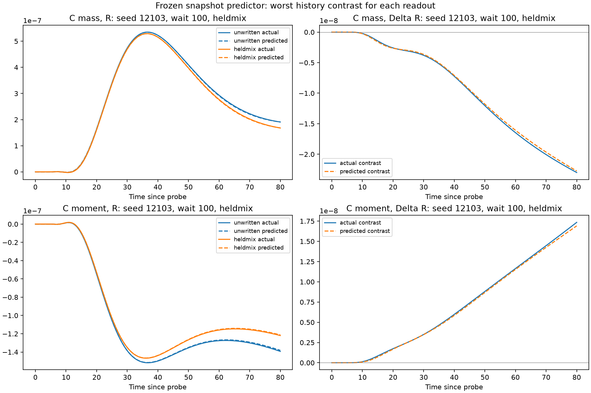

# Present-state transmission

**Result:** three current weighted pattern centers, measured relative to the
fixed A/B/C anchors, suffice for useful response prediction in this late-snapshot
envelope. A frozen ordinary quadratic regression passes on three new preparations
and a withheld mixed write. Worst fresh errors are **0.420%/0.511% for C
mass/moment response** and **2.029%/1.701% for their history contrasts**, below
the unchanged 2%/10% targets. Neither write history nor future sham trajectories
are supplied. B position alone fails; adding source/shape or mediator measurements
is unnecessary for this selected predictor's demonstrated accuracy. This does
not make geometry the unique physical storage site or prove state minimality.

Living note, 2026-09-26. Base: merged `34c9b333057f3a059b53798674baa7e7e3da6ae2`.
The question is whether a small measurement of one CURRENT configuration predicts
its conditional fixed-A `.02` probe response and the independently predicted
written-minus-unwritten contrast. This is response prediction, not autonomous
state evolution, storage localization, minimality, or a new Atlas route.

## Prospective contract

Keep the SH35/mediator laws, assembly, anchors A=-28/B=-4/C=28, radius-8 compact
write support, waits 50/100, and 80-unit response horizon. Use C weighted u-squared
mass and signed moment, sampled every .5 units. A prediction receives only a
serialized extraction from a single `(2,N)` current field, static fitted model,
the declared probe and forecast times since that probe. No seed, case, filename,
write label/amplitude, wait, twin, future sham, trajectory or response enters it.
Checkpoint loading selects only `checkpoint_times` and `checkpoints`, never the
convenient future arrays in an old history file. Evaluator targets are separate.

Initial comparisons: development mean; B center only; all three centers relative
to fixed anchors; geometry plus three masses and widths; then those nine plus
three mediator means and three signed mediator spatial moments. Fixed windows
are the existing C2 windows. Mass is weighted u-squared, not conserved material.
Extraction scans the current arrays once conceptually, with multiple vector
reductions; it is not a local observer. No spatial template, FFT/rate or solver is
needed initially. Gaps alone would omit actuator alignment.

Fit a shared rank-4 temporal SVD basis, separately scaled readouts, and linear
or quadratic standardized features with ridge 1e-6 or 1e-3. All preprocessing,
basis, selection and regularization are fitted inside complete-preparation
leave-one-group-out folds. Include a fixed weight-10 difference loss on
development pairs to prevent common-response bias; inference is independent.
Retain evaluator-only temporal projection errors. If rank 4 fails the accuracy
targets by itself, inspect rank 6 before attributing failure to descriptors.
Do not interpret ill-conditioned feature ablation as a necessity result.

The old seeds 8101/10101/10102/10103 are exposed development data. Begin with
their saved odd-.4 and unwritten checkpoints/targets, and inspect feature
variation/conditioning before selecting a model. If they are correlated as
expected, a small extension on old preparations 8101/10101 will use negative
odd -.4 and a mixed odd .28/even .28 write (norm below .4), at the same waits.
Each must pass the existing three-pattern bounds throughout its history and
sampled probe continuation. All descendants of a preparation stay in one fold.
No thousands-of-snapshots sample inflation. Reserve fresh seeds 12101/12102/12103;
choose one withheld history after development and before any fresh preparation.

Use all 161 times and a fixed late window h=40..80, with each output separate.
Report RMS residual, maximum absolute residual, response/contrast RMS and
relative RMS, per preparation and worst cases. Targets are <=2% for each R and
<=10% for each resolved Delta_R in BOTH windows, no tuning after fresh access.
No division by write-only offsets/backgrounds. State-blind Delta_R=0 scores
100% on a resolved contrast. Sub-floor contrasts are unresolved, never passed.
For new histories refine a representative development contrast and the final
worst relative-error contrast from the same initial prepared state, at half dt
and doubled N, through write/wait/probe. Shared per-readout/window floor is
max(1e-12, five times the largest SUM of the two separate response refinement
RMS errors), across those checks. The fixed rule can raise the floor after final
refinement but cannot alter the error gates. Prior numerical evidence applies
only to unchanged cases. No Delta_Q/pathway claim is sought.

Freeze selected extraction/model/coefficients/criteria/history family before
fresh access. Persist descriptor-only predictions before nonlinear evaluation.
Permit up to two development repairs; if fresh results motivate repair that
panel becomes exposed and a separate untouched check is required. Stop when a
simple useful description succeeds; retain negative/limited outcomes too.

## Resources and evidence

1800 aggregate CPU seconds, development ceiling 1200 and roughly 600 reserved
for fresh evaluation/refinement. Meter preparation, simulation, fitting, plots
and analysis, including failures; reserve an additional 30 seconds for small
read-only inspection processes. Initial section bounds 120 CPU/180 wall seconds
and 1 GiB resident memory, to be checked against a pilot. Ordinary editing/tests
and publication are separate. One scientific process at a time. No paid compute,
large downloads, neural fitting or broad sweeps. Output directories and NPZ/JSON
files are exclusive. New evidence only; old portable packages remain read-only.
Publish all substantive new records, failures, commands and hashes in <=25 MiB
Git evidence, or a unique <=500 MiB compressed asset if needed. Review the actual
diff and merge with a reviewed-head guard; update the two existing Atlas homes.

## Development record

`old-fit-01` at ed3aeb5 used the 16 old late states from four preparations.
Three-center quadratic ridge (.001) gave grouped worst R/Delta_R errors
0.2754%/1.0634%; B-only gave 11.258%/34.458%, and the mean's Delta_R error is
100%. The rank-4 temporal projection's worst whole-response error was .0954%.
Geometry's weighted design condition was 66.3, versus 2.16e5 for the best
nine-variable shape fit and 3.28e9 for the fifteen-variable mediator fit.
These are approximation/conditioning comparisons, not information theorems.
The four preparation groups remain the effective replication count.

The planned extension ran next: two old initial preparations, negative odd -.4
and mixed odd .28/even .28 at waits 50/100. All histories/probes passed the regime
screen. Each two-branch response took about 4 CPU seconds; the original section
bounds (120 CPU seconds, 180 wall seconds, 1 GiB) have ample margin. The later
source cleanup adds deterministic scoring/freezing and separate inference-cost
receipts; it changes no physical law or prior evidence.

`extended-fit-01` retains all 24 states and all four preparation groups. The
three-center quadratic fit's worst total error is 2.892% (negative write,
seed 10101, wait 100, late signed moment), while its worst contrast error is
5.070%. Rank-4 projection is at most .139% on whole traces. Nine-variable shape
is marginal at 2.020% total/4.214% contrast; fifteen-variable mediator is
1.180%/1.655%, but weighted design conditions are 1.03e5 and 9.93e6 respectively.
No descriptor-insufficiency or mediator-necessity conclusion follows.

**Development repair 1, before its outcomes:** the current weight-10 paired loss
may trade total-response accuracy for already-adequate contrast accuracy. Repeat
the same finite fitting choices with pair weight 3, keeping the old fits. This
is a response-model repair with unchanged inputs/temporal rank, not a new state
claim or relaxed accuracy criterion. If needed, one compact descriptor repair
will add the current A probe/source overlap (integral of u times the fixed
unit-L2 source profile): it directly controls the instantaneous u-squared source
increment under the additive probe and distinguishes amplitude/phase at its
fixed actuator. This is a same-snapshot scalar, not response spectroscopy.

**Repair outcome and final selection.** `balanced-fit-01` uses exactly the same
linear/quadratic/ridge comparisons with paired-loss weight 3. Three-center
quadratic ridge 1e-6 now gives worst grouped total/contrast errors
1.4866%/5.1658%, with weighted design condition 29.07. Shape and mediator give
1.1633%/4.6743% and .9015%/4.5511%; their conditions remain 4.91e4/8.25e6.
Geometry and the best linear shape fit both use 80 response coefficients;
mediator uses 128. Thus the apparent earlier need for more inputs was partly a
fitting tradeoff. Select geometry, stop adding variables, and do not execute
the optional source-overlap repair. No current-feature collision or storage
necessity is established. Retain the failed weight-10 geometry fit.

`dev-refine-01` repeats the mixed history from seed 8101's same initial array,
with half dt and doubled N through both waits and both independent probe
branches. The declared shared floor remains 1e-12 for both readouts/windows.
This is newly checked numerical evidence, not inherited certification.
Science charged so far: 119.581 CPU seconds plus the fixed 30-second allowance.

**Fresh freeze, before preparation access.** Keep rank 4, the geometry quadratic
map/ridge 1e-6/pair weight 3 and the saved coefficients. Forecast independently
from three offsets, with no field or metadata queries. Fresh seeds are
12101/12102/12103; all have unwritten, odd +.4, and withheld odd +.2/even -.2
histories at waits 50/100. The withheld mixture has opposite even deformation
and intermediate odd displacement; it challenges training-history dependence,
though all states remain within the same prepared three-pattern regime. The
mean and B-only controls are also sealed. All panel predictions must be saved
before the first nonlinear reference outcome. The 2%/10% gates, h40..80 window,
floor rule, and final worst-contrast refinement stay fixed. No fresh-driven
repair is planned if this check fails; retain that domain limit.

## Fresh result and measured boundary

The freeze was written under source `75544ab` before any of seeds
12101/12102/12103 was prepared. `fresh-01` saves all 18 descriptor vectors and
all predictions before its first nonlinear reference. The response model takes
exactly three numbers per state: offsets of the u-squared weighted A/B/C centers
from -28/-4/28. Its other arguments are the fixed .02 probe and times since that
probe. Written and unwritten responses are separate evaluations; their predicted
difference never receives a true response or partner state.

All 18 responses and 12 contrasts pass for both readouts in both windows (120
scalar checks). These are three independent preparation groups, not 18 independent
preparations or thousands of independent time samples. The withheld odd +.2/even
-.2 history was never fitted. Its worst mass/moment contrast errors are
2.029%/1.701%; old-family odd +.4 gives 1.991%/1.372%. Thus the result survives
a changed preparation history, within the same supplied assembly and late-wait
family. Fresh A/B offsets mildly exceed individual training extrema; no claim
of broad extrapolation follows.

| Window | Worst R mass | Worst R moment | Worst Delta_R mass | Worst Delta_R moment |
|---|---:|---:|---:|---:|
| Whole h=0..80 | 0.3445% | 0.4297% | 2.0295% | 1.7005% |
| Late h=40..80 | 0.4199% | 0.5115% | 1.9675% | 1.6529% |

| Preparation | Worst R mass | Worst R moment | Worst Delta_R mass | Worst Delta_R moment |
|---|---:|---:|---:|---:|
| 12101 | 0.1455% | 0.1810% | 1.2734% | 1.1148% |
| 12102 | 0.0573% | 0.1746% | 1.0438% | 0.8576% |
| 12103 | 0.4199% | 0.5115% | 2.0295% | 1.7005% |

The worst total-response case is unwritten seed 12103 at wait 100, late window:
RMS residuals 1.4151e-9 mass / 6.8651e-10 moment, against response RMS
3.3699e-7 / 1.3422e-7. Maximum point residuals are 2.1002e-9 / 1.1382e-9.
The worst contrast for both outputs is that seed's withheld mixture at wait 100,
whole window: RMS residuals 2.4350e-10 / 1.4959e-10, against contrast RMS
1.1998e-8 / 8.7968e-9. Maximum point residuals are 4.1918e-10 / 4.3486e-10.
All per-case absolute/normalized scores are retained in the linked summary.



The frozen B-only control has worst fresh R errors 17.00%/23.75% and contrast
errors 32.67%/16.24%. The rank-4 development-mean control has worst R errors
19.19%/26.55% and exactly 100% contrast error. The earlier geometry miss remains
a fitted-formula failure: changing the training loss, with no extra inputs,
repaired it. Shape/mediator predictors received the same temporal flexibility
and four linear/quadratic/ridge choices; they improved some development scores
but were not needed or promoted to fresh evaluation after geometry passed.
Their larger, often poorly conditioned feature maps do not establish necessity.
The selected temporal basis's evaluator-only best projection has worst
development R/contrast error .139%/.9996%, including both windows. This diagnostic
is never an inference input.

No near-matched geometry collision was sought after geometry achieved the task.
The panel still does not identify which correlated fields physically store the
change; nor does it determine whether A or C can be omitted from the measured
description. A failed B-only regression is not a theorem that B's current state
contains no information. No feature ablation is a physical intervention.
Geometry is an adequate operational descriptor here; global sufficiency,
minimality, causal localization, new wait/probe regimes and sequential use remain
unresolved. The model cannot propagate geometry through the waiting period.
There is no autonomous closure, synthetic full-state reconstruction, recurrence,
neural advantage, or fresh field query hidden in prediction. Delta_Q is not scored.

## Numerical checks, access and cost

Both representative development mixture and final worst fresh mixture are
refined through write/wait/probe from their identical prepared arrays, using
half dt and twice N. The largest sum of the two separate response RMS errors
is 1.2532e-13 (late moment); five times that remains below the 1e-12 lower guard.
The shared floor is therefore 1e-12 for both outputs/windows. All primary
contrasts resolve above it. This is an empirical numerical estimate, not a
confidence interval, receiver-noise threshold or pointwise early-signal guarantee.
All sampled histories and probe branches satisfy the three-pattern bounds.

The full-history tangent previously received complete future unprobed fields.
This predictor removes that privilege, as well as write labels, wait/seed/case
metadata, twins and true baseline responses. The checkpoint loader reads only
the named checkpoint member/boundary; its returned object is one current array.
The fitting evaluator owns the separate full-field targets. Deployment needs
three descriptor scalars, 80 fitted response coefficients, 644 temporal-basis
values and eight fitted scaling values: **732 learned scalars (5,856 float64
bytes)**. Forecast grid, three anchors, probe contract and polynomial recipe
are additional static information. There are zero spatial templates, stored
training examples, rate evaluations, FFTs or solver steps during inference.
The selected model's JSON alone is 22,892 bytes, exceeding a raw current
two-field grid's 12,288 bytes; three descriptor values do not imply an automatic
total-storage advantage.

Extraction validates both full current arrays and performs dense fixed-window
reductions over N=768, constructing analytic masks transiently. It is a full
current-field acquisition, not a local observer. The experiment extracted 15
values per state to support comparisons, then passed only each model's declared
columns. A geometry-only call returns three offsets without computing mediator
moments/widths. A 1,000-call saved-state timing gives about 49.7 microseconds for
geometry extraction and 61.8 microseconds for the complete 322-value forecast,
including JSON-list conversion to arrays. The fresh panel's all-descriptor
extraction took .001499 CPU seconds; all three models' forecasts plus serialization
took .003675. These local timings are not a hardware-independent runtime claim.

All three fitting panels together took .5276 CPU seconds (including loading,
grouped preprocessing/SVD, candidate fits and diagnostics). New development
simulation/refinement took 119.0533 seconds; fresh preparation/history/probes
153.1999 and its final refinement 76.1410, within the reserved 600. Overall charge
is **382.904 CPU seconds (6.38 minutes)**: 350.904 metered, a conservative two
seconds for one failed accounting-script import, and the fixed 30-second
inspection/startup allowance. The failed filename `inspect.py` shadowed Python's
standard module before any scientific calculation; its script and failure receipt
remain in `accounting-01`, with the successful retry in `accounting-02`. Nonfatal
font-cache warnings did not restart either figure analysis. No simulation hit a
time/memory stop; maximum fresh section cost was 11.067 CPU seconds. Editing,
fast regression checks and publication are separate.

## Reproduction, evidence and publication

The [portable new-evidence index](../../evidence/present-state-transmission-2026-09-26/README.md)
links every candidate, frozen model, descriptor, reference branch, score, refinement,
failure, command and checksum. The primary saved score table is
[analysis-final/summary.json](../../evidence/present-state-transmission-2026-09-26/data/work/mediated_patterns/present_state_transmission/analysis-final/summary.json).
Do not rerun old history/reduction panels. Restore only the new package if needed,
and use unique output children. Exact commands and original execution revisions
are archived; example invocation from the repository root is:

```bash
OPENBLAS_NUM_THREADS=1 OMP_NUM_THREADS=1 python -m experiments.mediated_patterns.present_state_transmission fit --pair-weight 3 --data work/mediated_patterns/present_state_transmission/extension-01 --output work/mediated_patterns/present_state_transmission/NEW-fit
python -m pytest experiments/mediated_patterns/tests/test_present_state.py evidence/present-state-transmission-2026-09-26/tests -q
make check PYTHON=/path/to/prepared/python
python3 -I evidence/present-state-transmission-2026-09-26/restore.py --verify-only
```

The scoped tests check snapshot selection, exclusion of other boundaries/twins/
metadata, fixed anchors, independent inference with solver imports blocked,
grouped splits, train-only preprocessing, deterministic serialization, safe
outputs, response subtraction, prediction hashes and floor/score arithmetic.
CI runs these fast regression/saved-data checks, never the new scientific panel.
The [critical review](../../evidence/present-state-transmission-2026-09-26/review.md)
and publication receipt separate software checks, scientific claims and remote
integration. Earlier frozen results, including the even pilot, C24 failures,
AB20/C32, C-probe negative, relay amplitude miss and finite-retention result,
remain byte-for-byte outside this diff. No scientific successor is selected.
